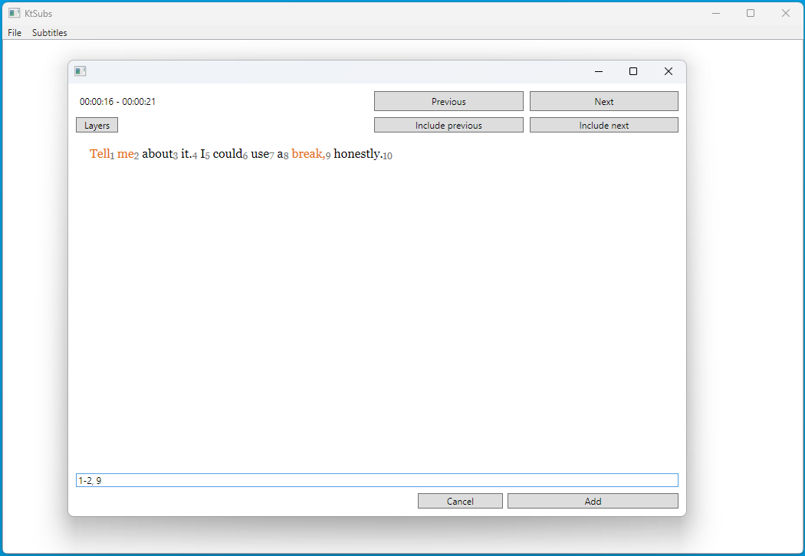

# KtSubs

KtSubs is a desktop application designed to elevate your language learning experience by simplifying the process of creating word lists from subtitles. This user-friendly tool allows you to effortlessly make lists of words/phrases from currently loaded subtitles. The application integrates with the VLC media player's HTTP module, enabling the retrieval of timestamps. Additionally, it supports popular subtitle formats such as '.srt' and '.ssa' and provides the ability to load subtitles from '.mkv' files using `MKVToolNix – Matroska tools for Linux/Unix and Windows`.

## Supported Subtitle Formats

KtSubs supports loading subtitles in two popular formats:
- **.srt**: SubRip Subtitles
- **.ssa**: SubStation Alpha Subtitles

Additionally, KtSubs provides the capability to load subtitles from **.mkv** files. To utilize this feature, you will need to have `MKVToolNix – Matroska tools for Linux/Unix and Windows` installed on your system.

## VLC media player configuration

[https://wiki.videolan.org/VSG:Interface:HTTP/](https://wiki.videolan.org/VSG:Interface:HTTP/)

**Note: You may need to restart VLC.**

## KtSubs configuration

1. Set `Web Interface Password` (Vlc's http password) and `Port` in Settings (File > Settings)
2. (Optional) Enter the path to your MKVToolNix installation folder in the "MkvToolnixFolder" input.

## Usage
1. Load Subtitles:
    - Navigate to the top menu and select Subtitles -> Load Subs.
    - Choose the subtitle file you want to work with.

2. Display Selection Screen:
    - Press F11 whenever you want to view the selection screen.
    - You can change currently displayed entry or combine it with adjacent entries.
    - Write pattern for selection in the input at the bottom of the view and confirm it with ENTER or `Add` button.

3. Save Word List:
    - To save your word list, go to File -> Save in the menu.
    - Choose a location and provide a name for your file.

## Selection screen pattern examples

- `1,2,5` - Select 1st, 2nd and 5th word.
- `1-5` - Select each word between the 1st and the 5th word as a sentence.
- `1-5*` - Select each word between the 1st and the 5th word.
